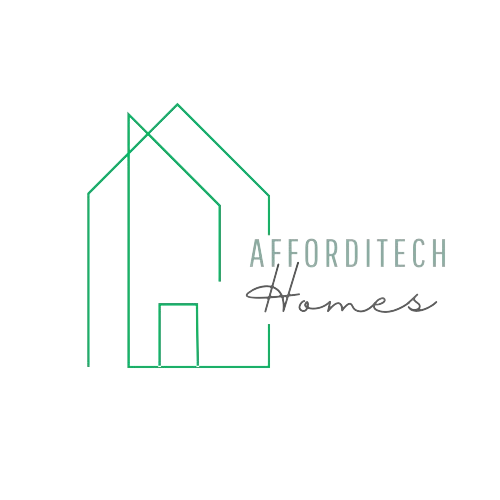
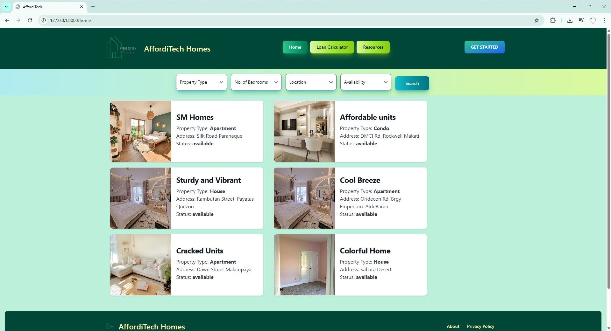
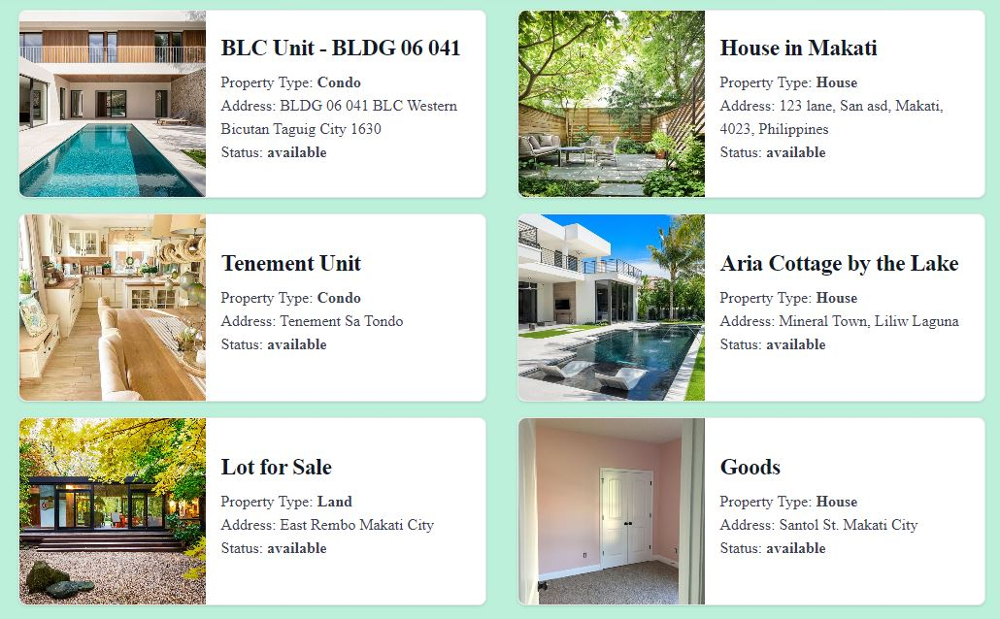
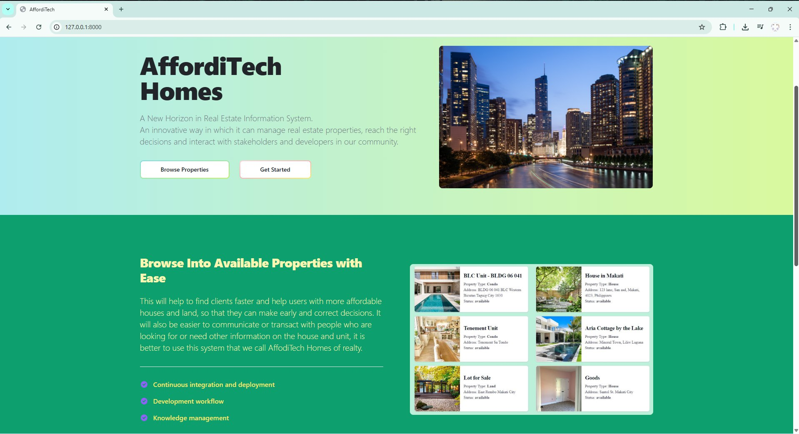
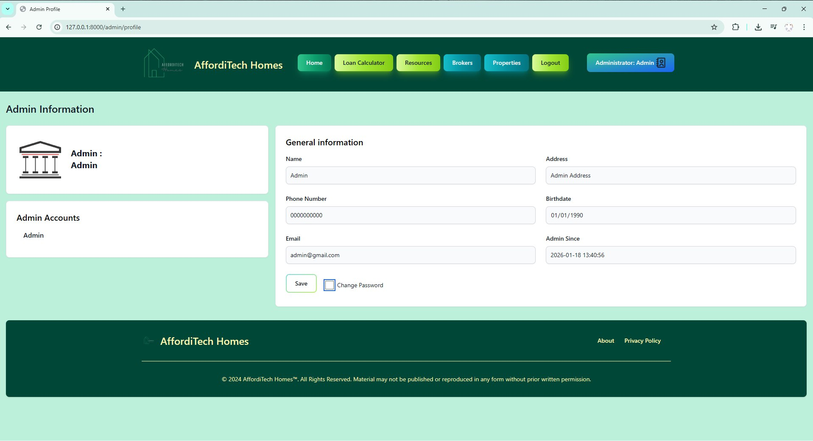
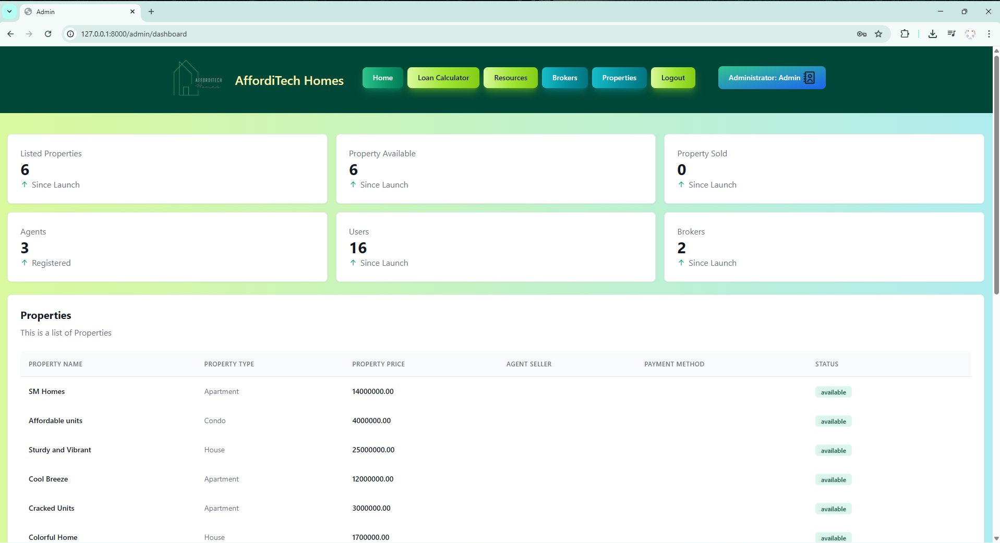
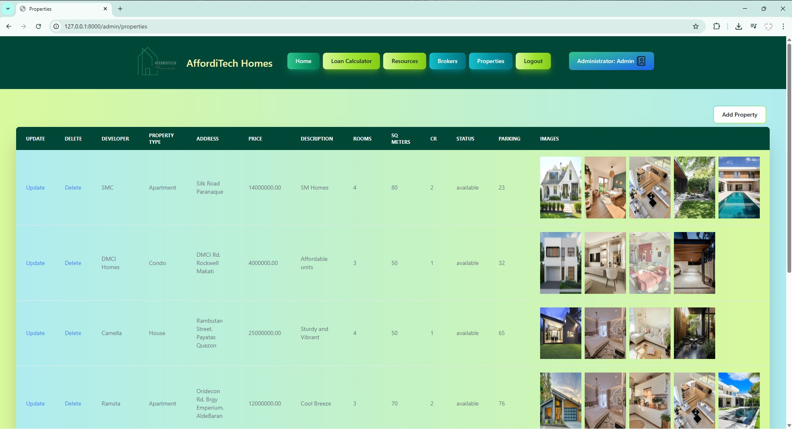

# AffordiTechHomes



A modern real estate web application built with Laravel and Vue.js, designed to connect property buyers, sellers, brokers, and agents in one seamless platform.

---

## 📋 Prerequisites

Make sure the following software is installed on your system:

- **XAMPP** - Apache and MySQL server
- **PHP** (version 8.1 or higher)
- **Composer** - PHP dependency manager
- **Node.js** - JavaScript runtime (includes npm)

---

## 🚀 Installation

### 1. Clone the Repository

```bash
git clone https://github.com/your-username/AffordiTechHomes.git
cd AffordiTechHomes
```

### 2. Install PHP Dependencies

```bash
composer install
```

### 3. Install Node.js Dependencies

```bash
npm install
```

> **Note:** If you encounter peer dependency issues, use:
> ```bash
> npm install --legacy-peer-deps
> ```

### 4. Environment Setup

Copy the example environment file and configure your database:

```bash
cp .env.example .env
```

Update the `.env` file with your database credentials:

```env
DB_CONNECTION=mysql
DB_HOST=127.0.0.1
DB_PORT=3306
DB_DATABASE=afforditechhomes
DB_USERNAME=root
DB_PASSWORD=
```

### 5. Generate Application Key

```bash
php artisan key:generate
```

### 6. Run Database Migrations

```bash
php artisan migrate
```

### 7. Create Storage Symlink

```bash
php artisan storage:link
```

### 8. Seed the Database

```bash
php artisan db:seed
```

---

## ▶️ Running the Application

You need to run **two terminals** simultaneously:

### Terminal 1 - Laravel Backend Server

```bash
php artisan serve
```

### Terminal 2 - Vite Development Server

```bash
npm run dev
```

The application will be available at: **http://localhost:8000**

---

## 🔐 Default Accounts

After seeding, the following accounts are available:

| Role   | Email              | Password    |
|--------|--------------------|-------------|
| Admin  | admin@gmail.com    | 123123123   |
| Broker | broker1@gmail.com  | 123123123   |
| Broker | broker2@gmail.com  | 123123123   |
| Agent  | agent1@gmail.com   | 123123123   |
| Agent  | agent2@gmail.com   | 123123123   |
| Agent  | agent3@gmail.com   | 123123123   |

---

## 📸 Application Demo

### Home Page
The main landing page where users can browse featured properties and navigate through the platform.



---

### Properties Listing
Browse all available properties with detailed information, pricing, and filtering options.



---

### About Page
Learn more about AffordiTechHomes, our mission, and the team behind the platform.



---

### Profile Page
User profile management where users can view and update their personal information.



---

### Admin Dashboard
Administrative control panel for managing users, properties, brokers, and agents.



---

### Admin Property Management
Admin interface for adding, editing, and managing property listings.



---

### Cityscape View
Beautiful cityscape imagery showcasing the urban properties available on the platform.


---

## 🛠️ Tech Stack

- **Backend:** Laravel (PHP)
- **Frontend:** Vue.js with Vite
- **Styling:** Tailwind CSS
- **Database:** MySQL
- **Authentication:** Laravel Sanctum

---

## 📄 License

This project is open-sourced software licensed under the [MIT license](https://opensource.org/licenses/MIT).

---

## 🤝 Contributing

Contributions, issues, and feature requests are welcome! Feel free to check the issues page.

---

**Made with ❤️ by AffordiTechHomes Team**
